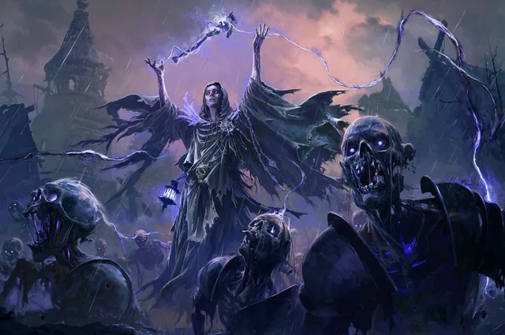

---
tags:
- poe2
- build
- lich
- chaos-dot
- league-starter patch: "0.4" class: Witch / Lich source: https://mobalytics.gg/poe-2/builds/chaos-dot-lich-starter-deadrabbit author: DEADRABB1T updated: 2025-12-20
---
# [0.4] ED Contagion Lich ビルド解説



> **結論:** Eternal Life を軸にした「ES が残る限りライフが減らない」防御構造と、Contagion による連鎖拡散型 Chaos DoT の組み合わせが核心。低投資でも高い耐久力と高密度マップでの殲滅力を両立する。

原典: [DEADRABB1T — Mobalytics](https://mobalytics.gg/poe-2/builds/chaos-dot-lich-starter-deadrabbit) / [Twitch](https://www.twitch.tv/deadrabb1t)

---

## 1_ シナジー構造（概要）

このビルドは4つのレイヤーが噛み合って機能する。

```
┌─────────────────────────────────────────────────────┐
│  OFFENSE                                            │
│  Contagion (AoE拡散) → Essence Drain (Chaos DoT)   │
│  DoTが敵間で連鎖拡散    Dark Effigy (単体DPS補強)  │
├─────────────────────────────────────────────────────┤
│  DEBUFF                                             │
│  Despair (-Chaos耐性)                               │
│  Withering Presence (Wither蓄積 → 被Chaos↑)        │
│  Temporal Chains (敵の行動速度↓)                    │
├─────────────────────────────────────────────────────┤
│  DEFENSE                                            │
│  Eternal Life（核心: ES残存中 → ライフ変動しない）  │
│    ├ Soulless Form (ES基盤 + マナ回復)              │
│    ├ Atziri's Disdain (ダメージ軽減)                │
│    └ Heavy Buffer (最大ES大幅増)                    │
│  → 25%ダメージ軽減 + ES 10,000超                   │
├─────────────────────────────────────────────────────┤
│  LOW LIFE VARIANT（上級）                           │
│  Eternal LifeでHP固定 → Low Life状態を安全に維持    │
│  Execute III / Tecrod's Gaze / Final Barrage /      │
│  Quick Response の追加ボーナス獲得                   │
└─────────────────────────────────────────────────────┘
```

---

## 2_ 攻撃の核心: Contagion + Essence Drain 連鎖拡散

### 操作ローテーション

|#|アクション|対象|
|---|---|---|
|1|Contagion をキャスト|敵の群れ|
|2|Essence Drain を当てる|任意の1体|
|3|DoT が Contagion 経由で自動拡散|周囲全体|
|+|Dark Effigy + Despair|ボス・硬いレア|

高密度マップほど Contagion の連鎖拡散が加速度的に効率を上げる。操作が2ステップで完結するシンプルさもリーグスターターとして優秀な理由。

### 単体火力の補強

- **Dark Effigy**: Chaos DoT debuff がある敵に projectile (投射物)を撃つトーテム。debuff の種類が多いほど発射数が増える
- **Despair**: Chaos 耐性を低下させるカース
- **Withering Presence**: Wither スタック蓄積で被 Chaos ダメージ増加

---

## 3_ DoT ダメージ計算構造

Essence Drain の最終 DoT DPS は以下の乗算チェーンで決まる:

```
最終DPS = Base DoT
        × (1 + Σ Increased)
        × Π (1 + More)
        × (1 + DoT Multiplier)
        × 敵の被ダメ係数
```

### 各段階の詳細

#### ① Base Chaos DoT（ジェムレベル依存）

- Lv1: 42/秒 → Lv20: 2,170/秒
- ジェムレベルだけで決まるため武器 DPS に依存しない
- `+Chaos Skill Level` の装備が Base 値を直接増加 → 投資対効果が高い

#### ② Increased（加算合計 → 1つの乗数）

- Increased Spell Damage + Increased Chaos Damage + Increased DoT の合計
- **ED 特権**: 通常 DoT には Spell Damage は乗らないが、ED と Contagion は例外として明示されている
- 加算なので収穫逓減が発生する（+200% → x3.0 に +50% 追加しても x3.5 で 16.7% しか増えない）

#### ③ More / Less（サポートジェム同士が乗算）

- More 同士は互いに掛け合わされる → 1つ追加するたび「現在の合計 DPS」に対して乗算
- 主要源: Swift Affliction, Zenith, Eldritch Empowerment 等
- → [[#4_ サポートジェム乗算構造]] で詳述

#### ④ DoT Multiplier（独立乗算枠）

- Increased とも More とも別枠で掛かる
- DoT Multi 同士は加算（+20% × 2 = +40% → x1.40）
- 少量でも効率が良い（独立枠なので他の数値に埋もれない）

#### ⑤ 敵側デバフ（被ダメ増加）

- **Despair**: -Chaos 耐性（例: -30% → x1.30）
- **Wither**: 1スタックあたり約 6% 被 Chaos 増加、最大スタック時に大幅な実質 More
- Wither 15stk (x1.90) + Despair -30% (x1.30) = 合計約 **x2.47**
- 自分側のスケーリングを全て終えた後にさらに掛かるため、ボス戦では Wither 維持が火力に直結

### 回復への還元

- ED は tooltip DoT の **0.5%** を敵1体あたりのライフ回復として還元
- 回復量は tooltip DoT にのみ依存し、敵が実際に受けたダメージ量には依存しない
- Despair/Wither で敵の被ダメが上がっても回復量は変わらない
- ただし Contagion で多数の敵に DoT が乗っていれば「敵の数 × 0.5%」で大量に回復

---

## 4_ サポートジェム乗算構造

### ED のサポートジェム構成（キャンペーン版）

| サポートジェム                | More 乗数                   | 代償                  | なぜ代償が空振りするか                                     |
| ---------------------- | ------------------------- | ------------------- | ----------------------------------------------- |
| **Chain**              | なし（クリア補助）                 | —                   | Contagion 拡散との二重カバーで群れを漏らさない                    |
| **Zenith II**          | 30% more Spell Damage     | マナ 90% 以上維持         | Soulless Form の高マナ回復で条件維持が容易（Lich 特権）           |
| **Swift Affliction I** | 30% more non-Ailment DoT  | 20% less Duration   | Contagion が常時再塗りするため持続時間短縮が実質無害                 |
| **Considered Casting** | 25% more Spell Hit Damage | 10% less Cast Speed | DoT ビルドはキャスト頻度で DPS が決まらないため Cast Speed 低下はほぼ無害 |

### Ascendancy の More 源

| ソース                             | More 乗数               | 条件                             |
| ------------------------------- | --------------------- | ------------------------------ |
| **Eldritch Empowerment** (Lich) | 30% more Spell Damage | スキルに ES コストが発生（ES が十分に積めてから取得） |

### 乗算チェーン計算

```
Zenith II:           x1.30
Swift Affliction I:  x1.30
Considered Casting:  x1.25
Eldritch Emp.:       x1.30
─────────────────────────
合算: 1.30 × 1.30 × 1.25 × 1.30 = x2.75

※ Chain は DPS 乗数を持たない（クリア補助枠）
```

### 設計の巧さ

全4枠が「このビルドの文脈ではデメリットが消える or 極小になる More 源」として機能している:

1. **Swift Affliction** の Duration 短縮 → Contagion 再塗りで無害
2. **Considered Casting** の Cast Speed 低下 → DoT はヒット頻度に依存しないので無害
3. **Zenith** のマナ条件 → Lich の Soulless Form で楽に維持
4. **Eldritch Empowerment** の ES コスト → ES 10K+ あるエンドゲームでは些細

---

## 5_ 防御の核心: Eternal Life + 大量 ES

### 防御フロー

```
被ダメージ
  → 25% 軽減 (Soulless Form + Atziri's Disdain + Heavy Buffer)
    → ES 10K+ で全て受け止める
      → Eternal Life: ES > 0 → ライフ不変
        → Temporal Chains で敵行動↓ → ES リチャージの隙間を確保
```

### 主要防御コンポーネント

- **Soulless Form** (Lich Ascendancy): ES 基盤 + 最大ライフ基準のマナ回復
- **Atziri's Disdain** (ユニークヘルム): ダメージ軽減
- **Heavy Buffer** (パッシブ): 最大 ES 大幅増
- **Eternal Life** (Lich Ascendancy): ES 残存中ライフが変動しない（核心）
- **Blasphemy + Temporal Chains**: 敵の行動速度低下 → ES リチャージの隙間を作る

### Low Life バリアント

Eternal Life で HP を固定できる仕組みを逆手に取り、意図的に Low Life 状態を維持:

- **Execute III**: Low Life 時のボーナス
- **Tecrod's Gaze**: Low Life 時の追加効果
- **Final Barrage**: Cast Speed ボーナス
- **Quick Response**: ES リチャージ高速化

通常「ライフが低い」状態は即死リスクだが、Eternal Life の「ライフが変動しない」性質がリスクを完全に無効化。「本来デメリットの状態を、メカニクスの噛み合わせで安全にボーナスだけ得る」設計。

---

## 6_ リーグスターターとして優秀な理由

### Strengths

- **装備依存度が低い**: ED/Contagion はジェム自体の Base DoT でスケールするため、レアドロップに左右されにくい
- **防御がパッシブツリー主導**: Eternal Life + ES 積みはパッシブノードの取得で成立するため、装備更新を待たずに機能し始める
- **操作が極めてシンプル**: Contagion → ED の2ステップ。ボス戦で Dark Effigy + Despair を足すだけ

### Weaknesses

- **マナ消費が重い**: 複数スキルの連射でマナが枯渇しやすい。Soulless Form のマナ回復とフラスクで対処するが、序盤はやや窮屈

---

## 7_ 宝飾細工人のプリズム (Jeweller's Orb) 優先順序

手に入り次第、以下の順序で使用して問題ない:

1. **Essence Drain** — 最優先。メイン DPS のソケット拡張
2. **Contagion** — 拡散範囲・効率向上
3. **Dark Effigy** — 単体 DPS 補強
4. **Despair** — カース効果強化
5. **Blasphemy** — Temporal Chains 周り

サポートジェムのソケットが足りない場合は、ビルドガイド記載の Gem Priority の順序で下位から切る。

---

## 8_ パッシブツリー方針

### レベリング中の優先度

1. ダメージノード優先: Potent Incantation → Lingering Horror → Void → Dark Entries
2. ES ノードは装備が揃い始めてから: Melding → Heavy Buffer → Patient Barrier

### Ascendancy 取得順序

1. **Soulless Form** — ES 基盤 + マナ回復
2. **Eternal Life** — Atziri's Disdain + Heavy Buffer が揃うとさらに強力
3. **Whispers of Doom** — 追加カース枠
4. **Eldritch Empowerment** — ES コストを維持できるようになってから
5. **Crystalline Phylactery** — ジュエル枠

---

## メモ

- パッチごとに数値が変わるため、計算式の構造（乗算レイヤーの関係）と具体数値は分けて理解する
- PoE 2 の日本語情報源は少ないため、このレベルのメカニクス解説は公開価値がある
- keii-dev.com への掲載は Bujo スタイルの HTML 版を別途作成済み